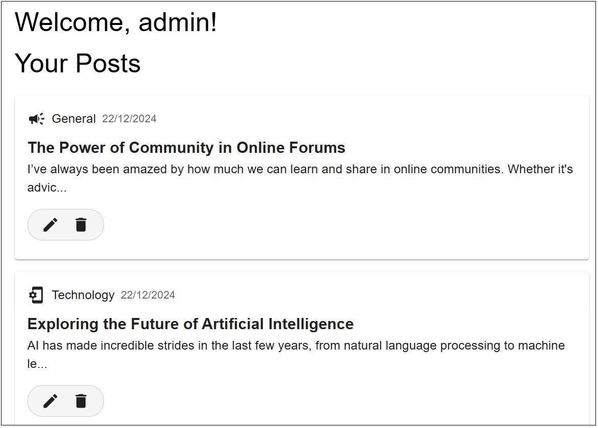
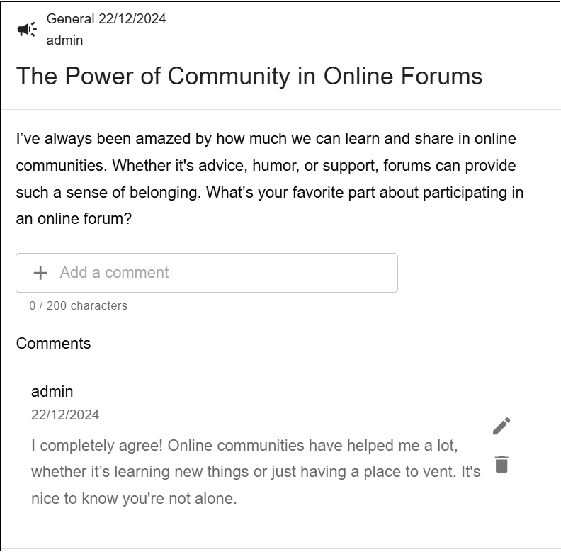

[![Contributors][contributors-shield]][contributors-url]
[![Forks][forks-shield]][forks-url]
[![Stargazers][stars-shield]][stars-url]
[![Issues][issues-shield]][issues-url]

<!-- PROJECT LOGO -->
 

  

<h2 align="center">ChatterHub</h2>
  

    Web Forum
     
    <a href="https://github.com/SQ77/chatterHub/issues/new?labels=bug&template=bug-report---.md">Report Bug</a>
    ·
    <a href="https://github.com/SQ77/chatterHub/issues/new?labels=enhancement&template=feature-request---.md">Request Feature</a>
  

<!-- TABLE OF CONTENTS -->

  
Table of Contents

  <ol>
    <li>
      <a href="#about-the-project">About ChatterHub</a>
      <ul>
        <li><a href="#built-with">Built With</a></li>
      </ul>
    </li>
    <li>
      <a href="#getting-started">Getting Started</a>
    </li>
    <li><a href="#usage">Usage</a></li>
    <li><a href="#roadmap">Roadmap</a></li>
    <li><a href="#contributing">Contributing</a></li>
    <li><a href="#contact">Contact</a></li>
    <li><a href="#acknowledgments">Acknowledgments</a></li>
  </ol>

<!-- ABOUT THE PROJECT -->
## About ChatterHub

 

ChatterHub is a dynamic and interactive web forum designed to foster vibrant online communities. It provides a platform where users can create discussions, share ideas, and engage in meaningful conversations across a variety of topics. Whether you're looking to connect with like-minded individuals, seek advice, or share your expertise, ChatterHub offers a welcoming space for open dialogue and collaboration. 

(<a href="#readme-top">back to top</a>)

### Built With

* [![React][React.js]][React-url]
* [![TypeScript][TypeScript]][TypeScript-url]
* [![MaterialUI][MaterialUI]][MaterialUI-url]
* [![TailwindCSS][TailwindCSS]][TailwindCSS-url]
* [![NodeJS][NodeJS]][NodeJS-url]
* [![Go][Go]][Go-url]
* [![Postgres][Postgres]][Postgres-url]

(<a href="#readme-top">back to top</a>)

<!-- GETTING STARTED -->
## Getting Started

1. Go to the [chatterHub website](https://chatterhubcvwo.netlify.app/)
2. Create an account by signing up with a username 
3. Create posts and comment on posts

(<a href="#readme-top">back to top</a>)

<!-- USAGE EXAMPLES -->
## Usage

### Profile Page

### Create Post

### View Posts

(<a href="#readme-top">back to top</a>)

<!-- ROADMAP -->
## Roadmap

- [x] View all posts
- [x] Filter posts by category
- [x] Search for posts by title
- [x] Sign in / Sign out
- [x] Upvote / downvote posts
- [x] Create, edit, and delete posts
- [x] Create, edit, and delete comments

See the [open issues](https://github.com/SQ77/chatterHub/issues) for a full list of proposed features (and known issues).

(<a href="#readme-top">back to top</a>)

<!-- CONTRIBUTING -->
## Contributing

Contributions are what make the open source community such an amazing place to learn, inspire, and create. Any contributions you make are **greatly appreciated**.

If you have a suggestion that would make this better, please fork the repo and create a pull request. You can also simply open an issue with the tag "enhancement".
Don't forget to give the project a star! Thanks again!

1. Fork the Project
2. Create your Feature Branch (`git checkout -b feature/AmazingFeature`)
3. Commit your Changes (`git commit -m 'Add some AmazingFeature'`)
4. Push to the Branch (`git push origin feature/AmazingFeature`)
5. Open a Pull Request

(<a href="#readme-top">back to top</a>)

### Top contributors:

<!-- CONTACT -->
## Contact

Project Link: [https://github.com/SQ77/chatterHub](https://github.com/SQ77/chatterHub)

(<a href="#readme-top">back to top</a>)

<!-- ACKNOWLEDGMENTS -->
## Acknowledgments

* [Developer - Shiqi](https://github.com/SQ77/)

(<a href="#readme-top">back to top</a>)

<!-- MARKDOWN LINKS & IMAGES -->
<!-- https://www.markdownguide.org/basic-syntax/#reference-style-links -->
[contributors-shield]: https://img.shields.io/github/contributors/SQ77/chatterHub.svg?style=for-the-badge
[contributors-url]: https://github.com/SQ77/chatterHub/graphs/contributors
[forks-shield]: https://img.shields.io/github/forks/SQ77/chatterHub.svg?style=for-the-badge
[forks-url]: https://github.com/SQ77/chatterHub/network/members
[stars-shield]: https://img.shields.io/github/stars/SQ77/chatterHub.svg?style=for-the-badge
[stars-url]: https://github.com/SQ77/chatterHub/stargazers
[issues-shield]: https://img.shields.io/github/issues/SQ77/chatterHub.svg?style=for-the-badge
[issues-url]: https://github.com/github_username/repo_name/issues
[TailwindCSS]: https://img.shields.io/badge/Tailwind%20CSS-%2338B2AC.svg?logo=tailwind-css&logoColor=white
[TailwindCSS-url]: https://tailwindcss.com/
[React.js]: https://img.shields.io/badge/React-%2320232a.svg?logo=react&logoColor=%2361DAFB
[React-url]: https://reactjs.org/
[NodeJS]: https://img.shields.io/badge/Node.js-6DA55F?logo=node.js&logoColor=white
[NodeJS-url]: https://nodejs.org/en
[Go]: https://img.shields.io/badge/Go-%2300ADD8.svg?&logo=go&logoColor=white
[Go-url]: https://go.dev/
[TypeScript]: https://img.shields.io/badge/TypeScript-3178C6?logo=typescript&logoColor=fff
[TypeScript-url]: https://www.typescriptlang.org/
[Postgres]: https://img.shields.io/badge/Postgres-%23316192.svg?logo=postgresql&logoColor=white
[Postgres-url]: https://www.postgresql.org/
[MaterialUI]: https://img.shields.io/badge/Material%20UI-007FFF?style=for-the-badge&logo=mui&logoColor=white
[MaterialUI-url]: https://mui.com/

